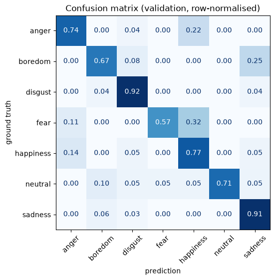
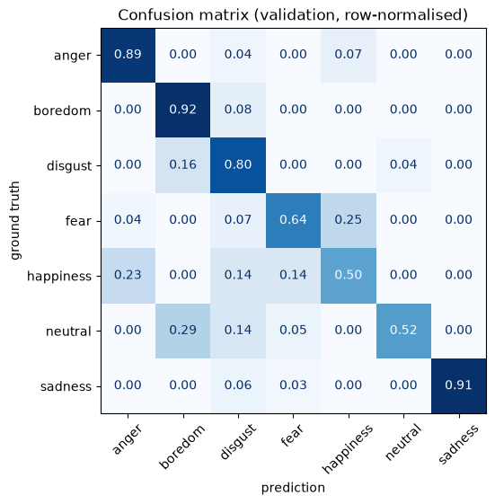
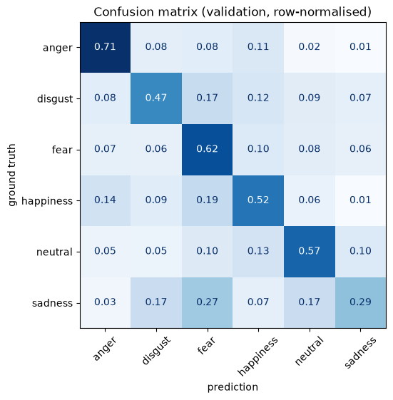
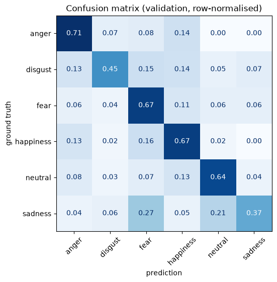
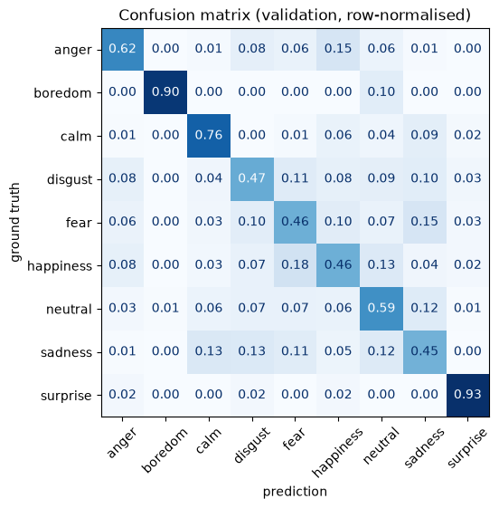
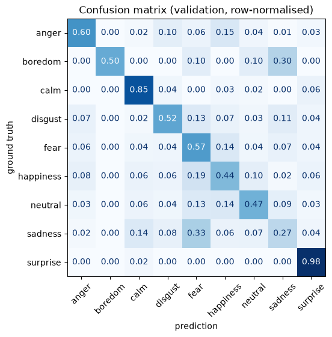

# Results: speech emotion recognition on mel-spectrograms

Two models, each trained on three dataset configurations:

- **ResNet-18 (transfer learning)**: [transfer_learning.ipynb](transfer_learning.ipynb). ImageNet weights. First only the new head is trained (8 epochs), then `layer4` is fine-tuned (8 epochs). RGB input, 224×224.
- **CNN from scratch**: [cnn_from_scratch.ipynb](cnn_from_scratch.ipynb). 4 conv blocks (1→32→64→128→256), GAP, dropout, linear head. About 1.2 M parameters, grayscale input, 128×128, 30 epochs.

The executed notebooks (with all outputs, learning curves included) are in `results/<config>/`. The same folder holds the `train_labels.csv` / `test_labels.csv` of each split.

## 1. Source data

Each `prepare_*.ipynb` notebook resamples its corpus to 16 kHz and cuts every recording into **3 s chunks**; a trailing chunk shorter than 1 s is dropped. Each chunk becomes a 64-band mel-spectrogram PNG. All chunks are listed in `data/spectrograms/labels.csv`, one row per spectrogram. Speaker ids in that file are global, so no two corpora share an id.

| dataset | language | speakers | recordings | spectrograms (3 s chunks) |
|---|---|---:|---:|---:|
| CREMA-D | English | 91 | 7 442 | 7 526 |
| EmoDB | German | 10 | 816 | 896 |
| RAVDESS | English | 24 | 2 452 | 3 691 |
| emoUERJ | Portuguese | 8 | 377 | 446 |
| **total** | | **133** | | **12 559** |

Emotion labels per corpus (in spectrograms). Not every corpus has every emotion: *boredom* only exists in EmoDB, and *calm* / *surprise* only in RAVDESS.

| dataset | anger | boredom | calm | disgust | fear | happiness | neutral | sadness | surprise |
|---|---:|---:|---:|---:|---:|---:|---:|---:|---:|
| CREMA-D | 1284 | – | – | 1314 | 1278 | 1272 | 1091 | 1287 | – |
| EmoDB | 144 | 119 | – | 133 | 124 | 117 | 104 | 155 | – |
| RAVDESS | 621 | – | 612 | 269 | 553 | 574 | 281 | 584 | 197 |
| emoUERJ | 114 | – | – | – | – | 104 | 96 | 132 | – |

Dataset composition as shown in the `app.py` explorer (all corpora / EmoDB only / CREMA-D only):


> The train/test colours in these screenshots come from an earlier *row-wise* split configuration. They show the size of each corpus correctly, but not the split used for the results below (see §2).

## 2. How the three `usable_data` datasets were built and split

All three splits were produced with `app.py` itself. [run_experiments.py](run_experiments.py) writes `data/split_config.yaml`, loads the app headless (Streamlit `AppTest`) and clicks **"Run train/test split"**. `usable_data/` is emptied before each split, because the app never deletes old files.

**Selection**: an *Exclusion* rule on the `dataset` column removes the corpora that are not wanted:

| config | exclusion rule | corpora kept |
|---|---|---|
| `emodb` | dataset ∈ {CREMA-D, RAVDESS, emoUERJ} | EmoDB |
| `cremad` | dataset ∈ {EmoDB, RAVDESS, emoUERJ} | CREMA-D |
| `all` | none | CREMA-D, EmoDB, RAVDESS, emoUERJ |

**Split**: one stage, `speaker` @ 80 %, mode **"Whole group (by value)"**, seed 42. So 80 % of the *speakers* go to train, taken with every one of their recordings and chunks. The remaining 20 % of speakers are **completely excluded from the training data** and form the test set, which the notebooks use as validation.

This matters for two reasons:

- a model can recognise a *voice* rather than an emotion. With a row-wise split, the same actor appears in train and test and the score is inflated;
- one recording gives several 3 s chunks. A row-wise split puts chunks of the *same utterance* on both sides.

Both notebooks check the split and print a warning if a speaker is shared between train and test. No warning appeared in any of the 6 runs, and the overlap computed from the label files is empty.

| config | train: speakers / spectrograms | test: speakers / spectrograms | test speakers |
|---|---|---|---|
| `emodb` | 8 (4 ♀, 4 ♂) / 714 | 2 (1 ♀, 1 ♂) / 182 | 2, 9 |
| `cremad` | 73 (35 ♀, 38 ♂) / 6 047 | 18 (8 ♀, 10 ♂) / 1 479 | 18 CREMA-D actors |
| `all` | 106 (55 ♀, 51 ♂) / 9 990 | 27 (9 ♀, 18 ♂) / 2 569 | CREMA-D 19, RAVDESS 5, emoUERJ 2, EmoDB 1 |

Details of the `all` split. The speaker draw is random across the whole pool, so it is **not stratified by corpus**:

| corpus | train speakers / spectrograms | test speakers / spectrograms |
|---|---|---|
| CREMA-D | 72 / 5 944 | 19 / 1 582 |
| RAVDESS | 19 / 2 884 | 5 / 807 |
| EmoDB | 9 / 811 | 1 / 85 |
| emoUERJ | 6 / 351 | 2 / 95 |

As a result, EmoDB is represented in the `all` test set by a single speaker, and *boredom* by only 10 test spectrograms. The test set is also 2:1 male.

Class imbalance, which is strong for *boredom*, *calm* and *surprise* in `all`, is handled in both notebooks with a cross-entropy loss weighted by inverse class frequency.

## 3. Results

Scores on the held-out speakers (test split). UAR is the unweighted average recall (= balanced accuracy = macro recall), which is the fairer metric when classes are imbalanced.

| config | classes | chance | ResNet-18 acc. | ResNet-18 UAR | ResNet-18 macro-F1 | CNN acc. | CNN UAR | CNN macro-F1 |
|---|---:|---:|---:|---:|---:|---:|---:|---:|
| `emodb` | 7 | 0.14 | **0.76** | **0.76** | **0.76** | **0.76** | 0.74 | 0.74 |
| `cremad` | 6 | 0.17 | 0.53 | 0.53 | 0.52 | **0.58** | **0.59** | **0.58** |
| `all` | 9 | 0.11 | **0.53** | **0.63** | **0.56** | 0.51 | 0.58 | 0.52 |

### EmoDB only

| ResNet-18 (transfer learning) | CNN from scratch |
|---|---|
|  |  |

### CREMA-D only

| ResNet-18 (transfer learning) | CNN from scratch |
|---|---|
|  |  |

### All corpora

| ResNet-18 (transfer learning) | CNN from scratch |
|---|---|
|  |  |

Confusion matrices are row-normalised: each row shows how the test spectrograms of one true emotion were classified.

## 4. Observations

- **EmoDB is the easiest corpus**: both models score around 0.75 on unseen speakers, 5× chance. It is small, studio-recorded, and its acted emotions are very pronounced.
- **CREMA-D is much harder**: 0.53–0.58. It has 91 actors of varied ages and ethnicities, lower-intensity renditions and noisier recordings. *Sadness* is the weakest class for ResNet-18 (recall 0.29), mostly confused with *fear* and *neutral*. On this larger corpus, the CNN trained from scratch beats ImageNet transfer learning.
- **All corpora together**: accuracy stays around 0.51–0.53, but with 9 classes, so chance is lower. The high UAR (0.58–0.63) comes largely from the corpus-specific classes: *calm*, *surprise* and *boredom* are each recorded by a single corpus. The model can partly identify them by recognising the corpus (recording conditions, language) instead of the emotion. Evidence: *surprise* has a recall of 0.93–0.98 but a precision of only 0.28–0.51, meaning other RAVDESS clips get pulled into it.
- **Neither model dominates**: transfer learning wins on the small EmoDB set and the mixed set, and the scratch CNN wins on CREMA-D.

## 5. Caveats

- **Small test sets.** EmoDB has 182 test spectrograms from only 2 speakers, so one speaker's style weighs heavily. Scores also vary between runs: GPU training is not bit-deterministic (`cudnn.benchmark`). A preliminary run of the scratch CNN on the identical EmoDB split scored 0.67 instead of 0.76. Treat differences of a few points as noise.
- **Test set used for model selection.** `cnn_from_scratch.ipynb` restores the weights of the epoch with the best *test* accuracy, which gives it a slightly optimistic estimate. `transfer_learning.ipynb` reports the last epoch; its best epoch was 0.79 / 0.55 / 0.53 for emodb / cremad / all. A separate validation split would remove this bias.
- **Non-stratified speaker draw** in `all`: see §2. A stratified draw, e.g. using the app's *Force entirely into test* rule to pick speakers per corpus and per gender, would make the per-corpus test sets more representative.

## Reproducing

```bash
.venv/bin/python run_experiments.py            # all three configs (≈ 35 min on an RTX 4050 laptop GPU)
.venv/bin/python run_experiments.py emodb      # a single one
```

Each run leaves `results/<config>/` with the executed notebooks, the confusion matrices, the classification reports, the label files of the split and the checkpoints (`*.pt`, not versioned). The script restores the original `data/split_config.yaml` and root-level `*.pt` files when it finishes. `usable_data/` is left holding the last split (`all`).
